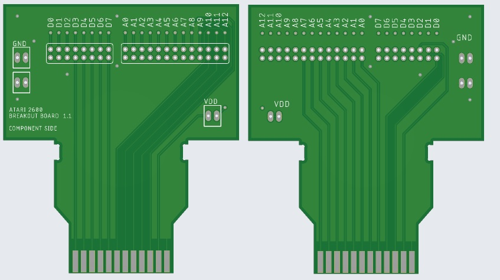

# a2600_breakout

Simple PCB to expose all cartridge lines.

Features:

 All data and address lines in triplicate (two through holes + one via)
 Standard 0.1" spacing
 Four GND points
 Two VDD points
 Fully labelled
 Double sided (including labels)
 Ground plane

For inquires please contact:

lodef.mode@gmail.com

