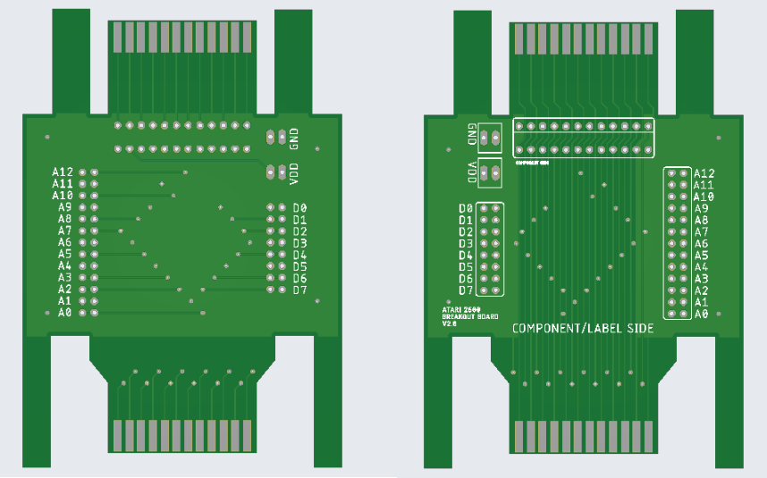

# a2600_breakout

Simple PCB to expose all cartridge lines on an Atari 2600.

Features:

<ul>
 <li>All data and address lines in triplicate (two through holes + one via)</li>
 <li>Optional cartridge connector for live monitoring</li>
 <li>Standard 0.1" spacing throughout</li>
 <li>Four GND points</li>
 <li>Two VDD points</li>
 <li>Fully labelled on both sides</li>
 <li>Ground plane</li>
 <li>Unlicenced / Public Domain
</ul>

For inquires please contact:

lodef.mode@gmail.com

