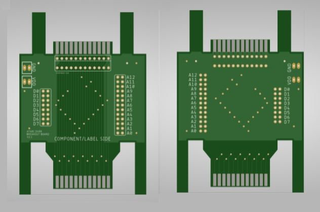

# a2600_breakout

Simple PCB to expose all cartridge lines on an Atari 2600.

Features:

<ul>
 <li>Multiple access points for all data and address lines
 <li>Optional cartridge connector for live monitoring (socket or edge connected)</li>
 <li>Standard 0.1" spacing throughout</li>
 <li>GND and VDD points</li>
 <li>Fully labelled on both sides</li>
 <li>Ground plane</li>
 <li>Unlicenced / Public Domain
</ul>

For inquires please contact:

lodef.mode@gmail.com

